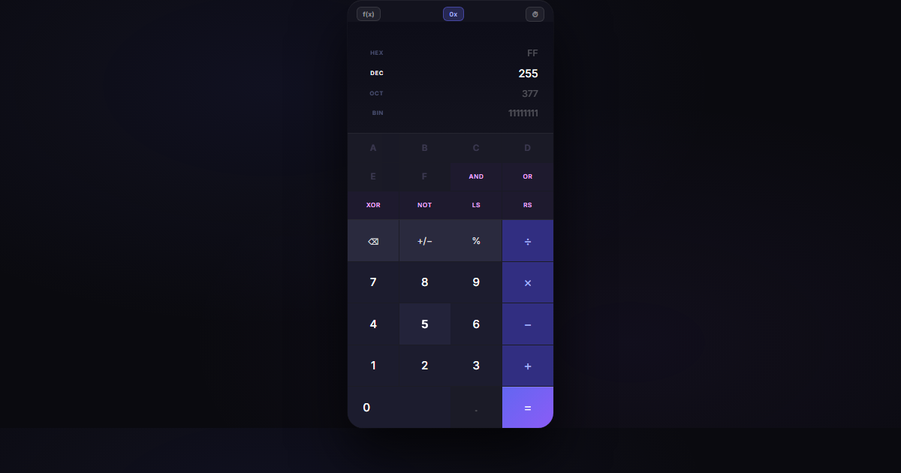

# Calculator

> Premium dark calculator with scientific mode, **programmer mode (HEX/BIN/OCT)**, history, and full keyboard + mouse control.



🔗 **[View Live →](https://umairjailani.github.io/Calculator_Project/)**

---

## Features

| Feature | Details |
|---------|---------|
| Programmer mode | Toggle with `0x` button — shows HEX / DEC / OCT / BIN simultaneously |
| Base switching | Click any base row to switch input mode (HEX → type A–F, BIN → only 0/1) |
| Bitwise operators | AND, OR, XOR, NOT, LS (left shift), RS (right shift) |
| Scientific mode | sin, cos, tan, √, x², x³, 1/x, log, ln, \|x\|, π, e |
| DEG / RAD toggle | Appears when scientific mode is on |
| Calculation history | Last 50 calculations, click any to restore — persists across sessions |
| Copy to clipboard | Click the display to copy the result |
| Keyboard support | `0–9` · `+ - * /` · `Enter` · `Backspace` · `Esc` · `%` |
| Smart AC / ⌫ | AC turns into ⌫ while typing — one button for both actions |
| No eval() | Safe expression engine, no code injection possible |

## Embed in your project

Drop this anywhere in your HTML:

```html
<iframe
  src="https://umairjailani.github.io/Calculator_Project/"
  width="420"
  height="680"
  frameborder="0"
  style="border-radius:28px"
></iframe>
```

Or use jsDelivr CDN to pull the files directly:

```html
<link href="https://cdn.jsdelivr.net/gh/UmairJailani/Calculator_Project@main/cal.css" rel="stylesheet" />
<div id="calc-root"></div>
<script src="https://cdn.jsdelivr.net/gh/UmairJailani/Calculator_Project@main/cal.js"></script>
```

## Theme with CSS variables

Override these on `:root` or any parent element:

```css
:root {
  --calc-bg:      #13131e;   /* calculator body */
  --calc-btn:     #1c1c2e;   /* number buttons */
  --calc-fn:      #2a2a3e;   /* AC, +/−, % */
  --calc-op:      #312e81;   /* operator buttons */
  --calc-eq:      #6366f1;   /* equals button */
  --calc-accent:  #a5b4fc;   /* highlights + active states */
}
```

## V1 vs V2

| | V1 (original) | V2 (this rebuild) |
|--|--|--|
| Engine | `eval()` | Safe state machine |
| Scientific mode | ❌ | ✅ 12 functions |
| History | ❌ | ✅ 50 entries, localStorage |
| Keyboard | ❌ | ✅ full support |
| Mouse-only use | ❌ | ✅ smart AC/⌫ |
| Design | basic | Glassmorphism dark |

## Run Locally

```bash
git clone https://github.com/UmairJailani/Calculator_Project.git
cd Calculator_Project
# open index.html in browser or VS Code Live Server
```

---

Made by [Umair Jailani](https://github.com/UmairJailani) · Built with [Claude Code](https://claude.ai/code)
